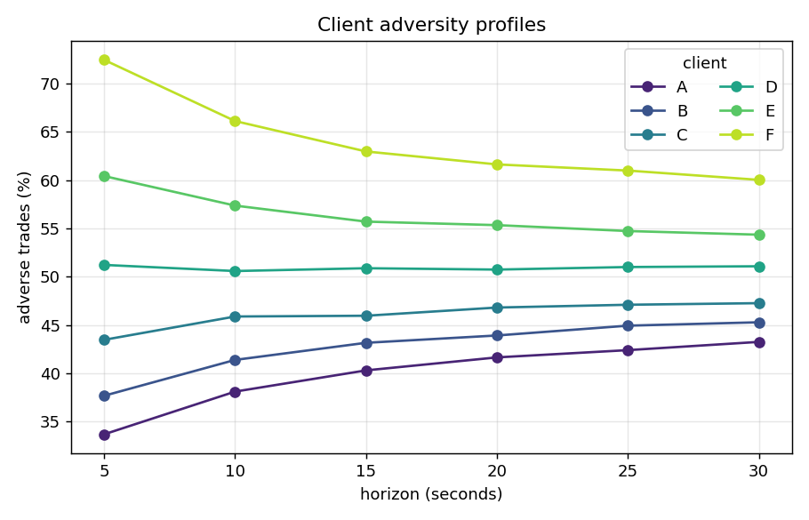
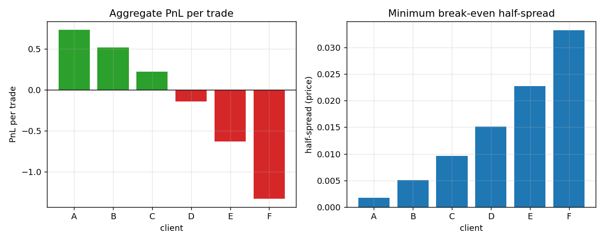
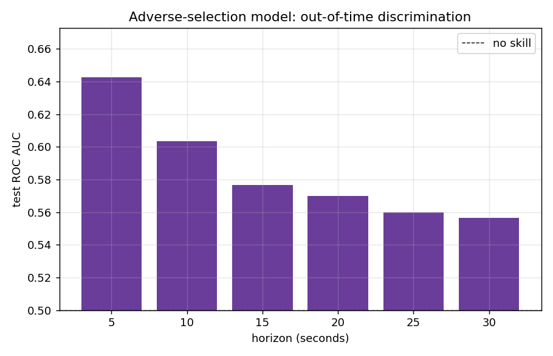
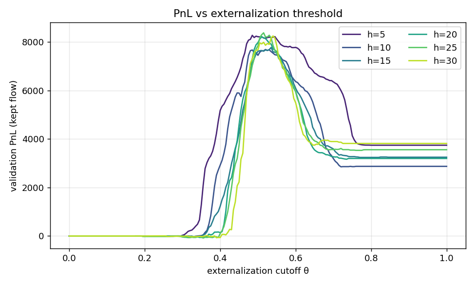
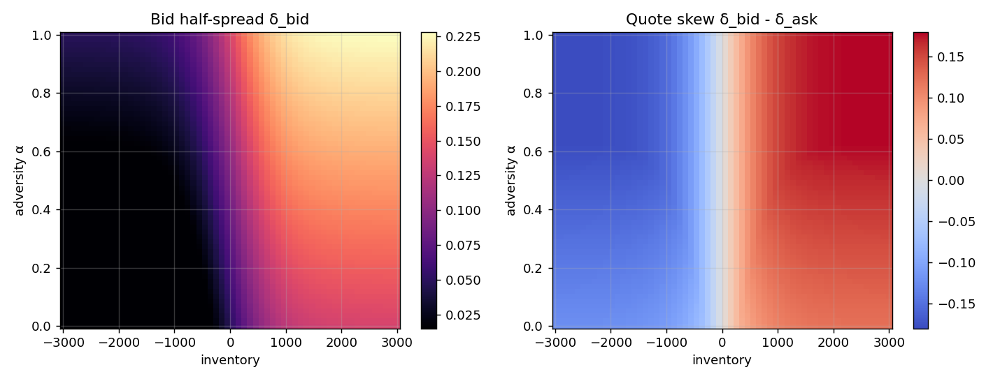
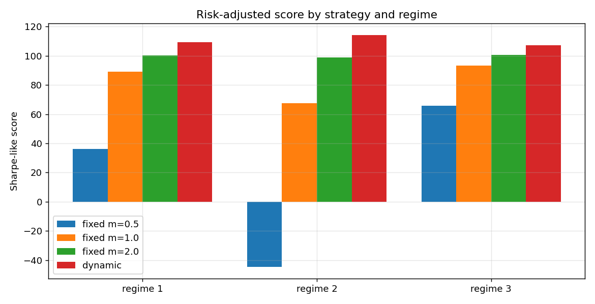

# adaptive-market-maker

An adverse-flow market-making engine. It profiles client adverse selection,
predicts it with a machine-learning model, externalizes the toxic flow, and
quotes dynamically under inventory and regime pressure, all evaluated on a
risk-adjusted (Sharpe-like) basis.

The pipeline is built around the question a liquidity provider actually faces:
*who is picking me off, can I see it coming, and how should I quote so I make
money without blowing up my inventory when the market turns?*

Everything runs on a self-contained synthetic market that is generated from a
microstructure model with genuine adverse selection and regime shifts, so the
results are reproducible end to end.

## Highlights

- **A realistic synthetic tape**: a mid-price path with permanent price impact,
  informed clients whose flow is directionally persistent, and regime shifts that
  change toxicity and volatility with no marker the models may use.
- **Adverse-selection analytics**: per-client adversity profiles, profitability,
  and the minimum half-spread that makes each client break even.
- **An out-of-time ML model** that predicts the probability a trade is adverse,
  one gradient-boosted classifier per horizon, evaluated on a strict by-day split.
- **An optimal externalization policy** driven by the model, with global and
  per-client cutoffs chosen on validation and reported out of sample.
- **A dynamic quoting strategy** that scales spreads with volatility, widens on
  toxic flow, and skews to flatten inventory, and that **beats fixed-spread
  baselines on the Sharpe-like score in every regime tested, with zero drawdown**.

## Results at a glance

Client flow separates cleanly from benign to toxic, and the break-even spread
rises in step with it:




The model has genuine out-of-time signal, strongest at the longer horizons where
adverse selection is most visible:



Externalizing the flow the model flags as toxic lifts PnL; too low a cutoff gives
away the good flow, too high a cutoff absorbs the bad:



The quoting function widens with adversity and skews against inventory, so the
book is pushed back to flat:



Across regimes with different (hidden) fill and penalty parameters, the dynamic
strategy delivers the best risk-adjusted score, and it stays steady in the stress
regime where a tight fixed spread loses money with a large drawdown:



## Install and run

```bash
pip install -r requirements.txt        # or: pip install -e .
python scripts/run_pipeline.py          # runs every stage, writes figures/
pytest -q                               # run the test suite
```

`scripts/generate_data.py` writes the tape to `data/trades.csv` if you want it on
disk; the pipeline generates it in memory by default.

## A quick look

```python
import mm

df = mm.generate()                       # synthetic tape
print(mm.profitability_table(df))        # who is profitable, and the break-even spread

model = mm.AdversityModel().fit(df)      # per-horizon adverse-selection model
print(model.metrics(df))                 # train / validation / test metrics

ext = mm.Externalizer(df, model)         # optimal externalization
print(ext.uplift(horizon=30))            # test PnL with vs without

dbid, dask = mm.quote(inventory=1200, sigma=0.03, alpha=0.7, eta=0.8)
```

## How the pieces fit

```
mm/
  data.py            synthetic market and client-flow generator
  adversity.py       adversity profiles, profitability, break-even spread
  model.py           per-horizon adverse-selection model (gradient boosting)
  externalization.py optimal externalization threshold from the model
  quoting.py         dynamic inventory-aware quoting function
  backtest.py        fill model, inventory penalty, regimes, Sharpe-like scoring
  metrics.py         Sharpe and drawdown helpers
scripts/             generate_data.py, run_pipeline.py
tests/               pytest suite
docs/methodology.md  formulas and modelling choices
```

## The dynamic quote

Half-spreads are quoted as multiples of volatility, `delta = m * sigma`. The fill
probability depends only on `delta / sigma`, so the multiple `m` is the real
control variable and is independent of the hidden fill parameters. The multiple
is built from observable signals only:

```
base = c_base + c_adv * alpha
skew = (c_inv + c_time * eta) * tanh(inventory / i_ref)
m_bid = base + skew,   m_ask = base - skew
```

Widening with the adversity score `alpha` charges for toxic flow; the skew pushes
inventory to zero and ramps up into the close, where the inventory penalty bites.
Because every input is an observable signal, the rule keeps working through regime
shifts without recalibration. See [docs/methodology.md](docs/methodology.md) for
the full derivation.

## Notes

- Built with the standard scientific Python stack (numpy, pandas, scikit-learn,
  matplotlib).
- The market data is entirely synthetic and generated by this repository.
- The fill and penalty parameters of a real venue are not observable, so the
  quoting gains are tuned to be robust across a range of plausible regimes rather
  than fitted to one.

## License

MIT. See [LICENSE](LICENSE).
